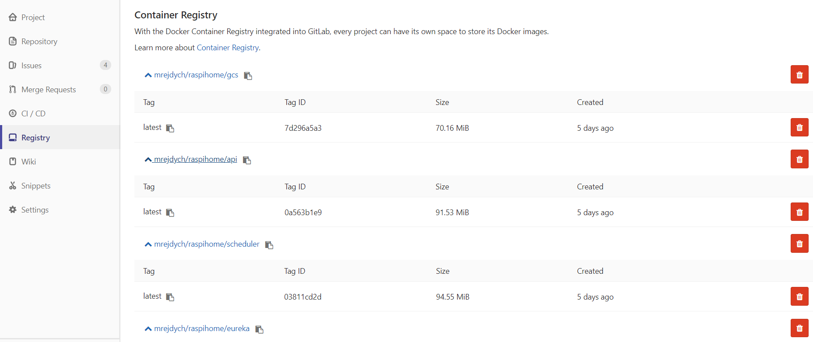
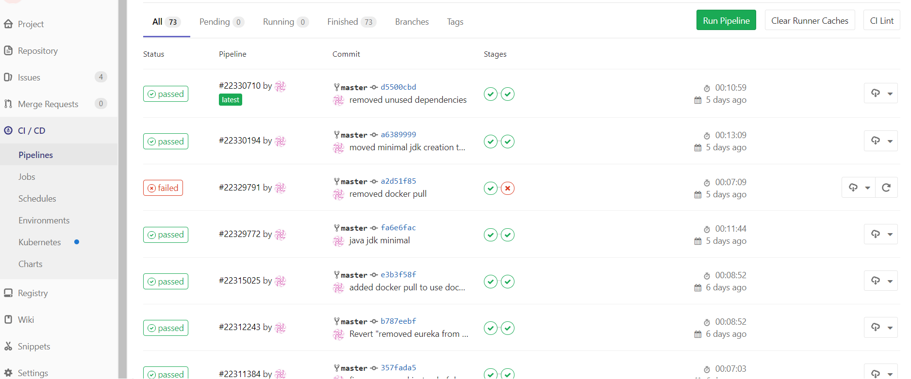
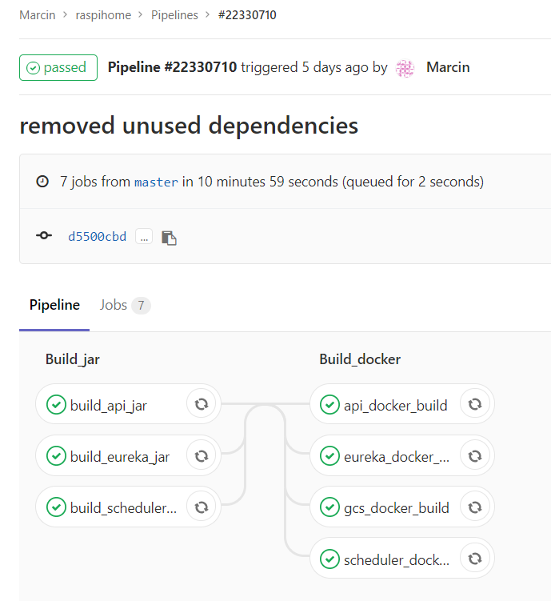
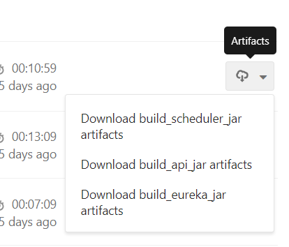
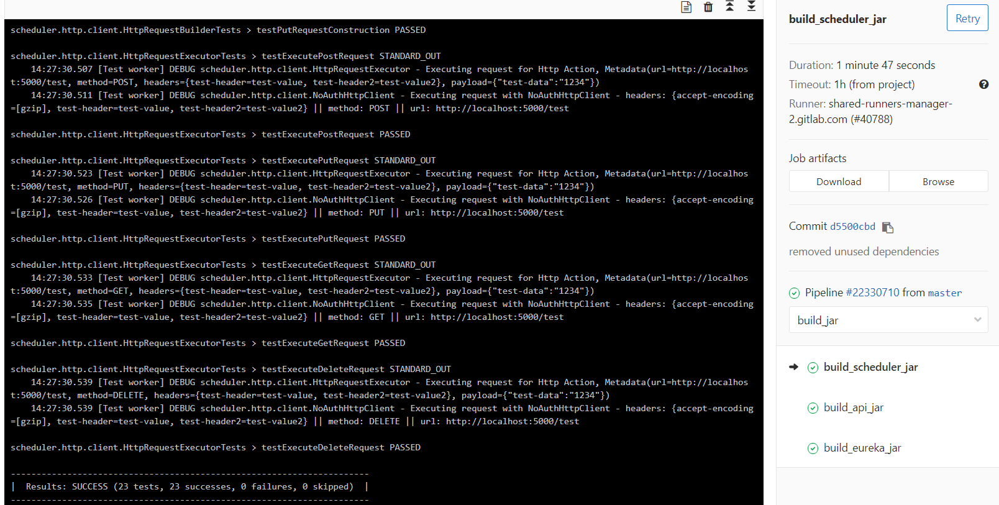
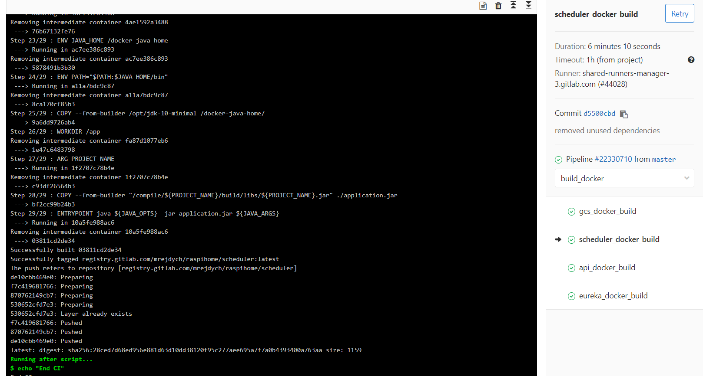

# Projekt: Wykorzystanie Dockera do zarządzania mikroserwisami
Podczas realizacji projektu zostały wykorzystane funkcjonalności będące częścią oprogramowania Docker oraz Docker-Compose.  

Aplikacja zarządzana przez Dockera w tej chwili jest zaimplementowana z użyciem języków Java, Kotlin oraz Python, dlatego należało stworzyć dwa niezależne Dockerfile:

## Dockerfile dla aplikacji wymagającej JVM:
```dockerfile
# stage 1 - download image with arm32v7 jdk
FROM arm32v7/openjdk:10-jdk-slim as arm32v7_jdk_10

# stage 2 - cache gradle dependencies and build minimal arm32v7 jdk
FROM openjdk:10-jdk-slim as builder
COPY --from=arm32v7_jdk_10 $JAVA_HOME /collect/jdk/
RUN apt-get update && apt-get install -y dos2unix
WORKDIR /collect
ENV GRADLE_USER_HOME=/collect/.cache
COPY *.gradle gradlew ./
COPY gradle/ ./gradle
COPY api/build.gradle ./api/
COPY scheduler/build.gradle ./scheduler/
COPY gcs/build.gradle ./gcs/
COPY eureka/build.gradle ./eureka/
COPY common-http/build.gradle ./common-http/
RUN dos2unix gradlew && ./gradlew --no-daemon install
ARG PROJECT_NAME
WORKDIR /compile
COPY . .
RUN cp /collect/gradlew . && ./gradlew --no-daemon :${PROJECT_NAME}:test :${PROJECT_NAME}:bootJar
RUN jlink --verbose --module-path /collect/jdk/jmods --no-header-files --no-man-pages --compress=2 \
        --add-modules java.base,java.logging,java.xml,jdk.unsupported,java.sql,java.naming,java.desktop,java.management,java.security.jgss,java.instrument,java.rmi \
        --output /opt/jdk-10-minimal

# stage 3 - runnable image
FROM arm32v7/debian:sid-slim as runnable
EXPOSE 80
ENV LANG C.UTF-8
ENV JAVA_HOME /docker-java-home
ENV PATH="$PATH:$JAVA_HOME/bin"
COPY --from=builder /opt/jdk-10-minimal /docker-java-home/
WORKDIR /app
ARG PROJECT_NAME
COPY --from=builder "/compile/${PROJECT_NAME}/build/libs/${PROJECT_NAME}.jar" ./application.jar
ENTRYPOINT java ${JAVA_OPTS} -jar application.jar ${JAVA_ARGS}

```
W celu zbudowania obrazu z aplikacją wykorzystana została funkcjonalność Dockera o nazwie ["multi stage build"](https://docs.docker.com/develop/develop-images/multistage-build/), z którego zostanie wykorzystany JDK10 przystosowany do architektury arm32v7.

Pierwszy etap ma na celu pobranie obrazu [arm32v7/openjdk:10-jdk-slim](https://hub.docker.com/r/arm32v7/openjdk/) z Docker Hub zawierającego w sobie JDK10 przeznaczone na architekturę arm32v7.

Podczas drugiego etapu wykonywane są następujące czynności:
- Uruchamiany jest przygotowany wcześniej task narzędzia gradle, który pobiera wszystkie zależności aplikacji z [Maven Central](https://mvnrepository.com/repos/central). Podczas tego etapu kopiowane są jedynie pliki konfiguracyjne gradle'a w celu wykorzystania funkcjonalności Docker'a polegającej na cachowaniu wcześniej zbudowanych warstw obrazu ( stworzona warstwa zawierająca wszystkie zależności może być ponownie wykorzystana podczas budowania tej samej lub innej aplikacji działającej na JVM ).
- Kopiowane są źródła aplikacji, następnie wywoływane są taski gradle'a służące do uruchomienia testów jednostkowych oraz zbudowania archiwum Jar ze skompilowaną aplikacją.
- Tworzona jest minimalna dystrybucja JDK10 zawierająca jedynie moduły wymagane przez aplikację. Wykorzystywana jest modularność Javy wprowadzona w ramach [Projektu Jigsaw](http://openjdk.java.net/projects/jigsaw/).

Podczas trzeciego etapu tworzony jest finalny obraz na bazie obrazu [arm32v7/debian:sid-slim](https://hub.docker.com/r/arm32v7/debian/), w którym instalowane są wcześniej przygotowane JDK10 oraz jar z aplikacją.

Dockerfile został przygotowany tak, aby proces budowania można było parametryzować poprzez [argument](https://docs.docker.com/engine/reference/builder/#arg) **"PROJECT_NAME"**, konfigurować parametry maszyny wirtualnej Javy poprzez zmienną środowiskową **"JAVA_OPTS"** oraz przekazywać argumenty wywołania do aplikacji poprzez zmienną środowiskową **"JAVA_ARGS"**.  
Za pomocą instrukcji [EXPOSE](https://docs.docker.com/engine/reference/builder/#expose) deklarowane jest udostępnienie portu 80.  
  


## Dockerfile dla aplikacji napisanej w języku Python:

```dockerfile
FROM resin/raspberrypi3-alpine-python:3.6.1-slim

WORKDIR /install

COPY requirements.txt .
COPY setup.py .

RUN apk add --no-cache --update build-base python3-dev git && \
    python setup.py install_deps && \
    rm -r /root/.cache && \
    apk del --purge -r build-base python3-dev git && \
    rm -rf /var/cache/apk/*

EXPOSE 80

WORKDIR /app
COPY . /app/

ENTRYPOINT python src/app_entry.py
```

Dockerfile dla aplikacji napisanej w języku Python jest znacząco prostszy od przedstawionego powyżej. Do bazowego obrazu [resin/raspberrypi3-alpine-python:3.6.1-slim](https://hub.docker.com/r/resin/raspberrypi3-alpine-python/) kopiowany jest kod aplikacji oraz instalowane są jej zależności.

## Plik .dockerignore
Z racji tego, że żródła kopiowane są podczas budowania za pomocą instrukcji [COPY](https://docs.docker.com/engine/reference/builder/#copy) . /$DIR dodano plik .dockerignore w celu wykluczenia nadmiarowych lub poufnych plików z kontekstu budowania Docker'a. Zawartość pliku .dockerignore wygląda następująco:

```docker
#python
venv
*/venv
__pycache__
dist
*.egg-info

#git
.gitignore
.gitlab-ci.yml
.git
README.md

#scripts
scripts
ci

#docker
.env
docker-compose.yaml
Dockerfile
*/Dockerfile

#idea
.idea
out
*/out
*.iml

#gradle
.gradle
build
*/build
```

Wpisy określają ignorowane pliki bądź katalogi.

## Docker-Compose
W celu uproszczenia budowania, konfigurowania, uruchamiania oraz zatrzymywania zestawu mikroserwisów wykorzystano Docker-Compose. To oprogramowanie konfigurowane jest za pomocą pliku [**docker-compose.yaml**](https://docs.docker.com/compose/compose-file/).

```yaml
version: "2.1"

services:
  postgresql:
    image: arm32v6/postgres:10.3-alpine
    container_name: postgresql
    restart: on-failure
    ports:
    - ${POSTGRES_PORT:-5432}:5432

  eureka:
    build:
      context: .
      args:
        PROJECT_NAME: eureka
    image: registry.gitlab.com/mrejdych/raspihome/eureka
    container_name: eureka
    restart: on-failure
    expose:
    - ${SERVER_PORT:-80}
    ports:
    - 10000:${SERVER_PORT:-80}
    environment:
      PORT: ${SERVER_PORT:-80}
      JAVA_OPTS: -Xmx62m -Xms30m

  api:
    build:
      context: .
      args:
        PROJECT_NAME: api
    image: registry.gitlab.com/mrejdych/raspihome/api
    container_name: api
    restart: on-failure
    expose:
    - ${SERVER_PORT:-80}
    ports:
    - 10001:${SERVER_PORT:-80}
    environment:
      EUREKA_URL: ${EUREKA_URL:-http://eureka/eureka}
      PORT: ${SERVER_PORT:-80}
    depends_on:
    - eureka


  scheduler:
    build:
      context: .
      args:
        PROJECT_NAME: scheduler
    image: registry.gitlab.com/mrejdych/raspihome/scheduler
    container_name: scheduler
    restart: on-failure
    expose:
    - ${SERVER_PORT:-80}
    environment:
      EUREKA_URL: ${EUREKA_URL:-http://eureka/eureka}
      PORT: ${SERVER_PORT:-80}
      POSTGRES_HOST: ${POSTGRES_HOST:-postgresql}
      POSTGRES_PORT: ${POSTGRES_PORT:-5432}
      POSTGRES_PASSWORD: ${POSTGRES_PASSWORD:-postgres}
      POSTGRES_USER: ${POSTGRES_USER:-postgres}
      POSTGRES_DATABASE: ${POSTGRES_DATABASE:-postgres}
    depends_on:
    - postgresql
    - eureka
    - api

  gcs:
    build: ./gcs/
    image: registry.gitlab.com/mrejdych/raspihome/gcs
    container_name: gcs
    restart: on-failure
    privileged: true
    devices:
    - "/dev/mem:/dev/mem"
    - "/dev/gpiomem:/dev/gpiomem"
    - "/dev/ttyAMA0:/dev/ttyAMA0"
    cap_add:
    - SYS_RAWIO
    expose:
    - ${SERVER_PORT:-80}
    environment:
      EUREKA_URL: ${EUREKA_URL:-http://eureka/eureka}
      PORT: ${SERVER_PORT:-80}
      GCS_INSTANCE_NAME: gcs-1
    depends_on:
    - eureka
    - api

  cadvisor:
    image: google/cadvisor
    ports:
    - 10009:8080
    container_name: cadvisor
    volumes:
    #- /:/rootfs:ro                           !!! for unix
    #- c:\:/rootfs:ro                         !!! for windows
    - "/var/run:/var/run:rw"
    - "/sys:/sys:ro"
    - "/var/lib/docker/:/var/lib/docker:ro"
```
Za pośrednictwem tego pliku można określić zbiór usług i automatycznie umieścić je w jednej, wspólnej [**sieci docker'a**](https://docs.docker.com/network/).  
Wykorzystane opcje konfiguracyjne:
- [**image**](https://docs.docker.com/compose/compose-file/#image): określa obraz bazowy dla danej usługi. Jeżeli jest użyty wraz z opcją build jest wykorzystywany przy poleceniach docker-compose pull oraz docker-compose push.
- [**build**](https://docs.docker.com/compose/compose-file/#build): określa parametry potrzebne do zbudowania obrazu dla danej usługi.
- [**ports**](https://docs.docker.com/compose/compose-file/#ports): umożliwia podanie listy udostępnionych portów z wnętrza kontenera do maszyny-hosta. Składnia mapowania - port-hosta:port-kontenera
- [**volumes**](https://docs.docker.com/compose/compose-file/#volumes): umożliwia podmontowanie do kontenera danego katalogu maszyny-hosta
- [**privileged**](https://docs.docker.com/compose/compose-file/#domainname-hostname-ipc-mac_address-privileged-read_only-shm_size-stdin_open-tty-user-working_dir): ustawienie na wartość true powoduje uruchomienie kontenera w trybie ze zwiększonymi uprawnieniami
- [**depends_on**](https://docs.docker.com/compose/compose-file/#depends_on): umożliwia określenie zależności pomiędzy usługami oraz kolejności ich uruchamiania
- [**restart**](https://docs.docker.com/compose/compose-file/#restart): umożliwia określenie w jakich sytuacjach kontener ma być ponownie uruchamiany po wystąpieniu błędu i zatrzymaniu się aktualnie uruchomionego kontenera
- [**environment**](https://docs.docker.com/compose/compose-file/#environment): umożliwia ustawienie zmiennej środowiskowej dostępnej wewnątrz kontenera. Aplikacje są zaimplementowane w ten sposób, że ich konfiguracja opiera się na odczytywaniu zmiennych środowiskowych (wszystkie posiadają odpowiednie wartości domyślne)

Zmienne podane w listach environment są automatycznie pobierane przez docker-compose z pliku [**".env"**](https://docs.docker.com/compose/env-file/):
```docker
SERVER_PORT=80

EUREKA_URL=http://eureka/eureka

POSTGRES_HOST=postgresql
POSTGRES_PORT=5432
POSTGRES_DATABASE=postgres
POSTGRES_PASSWORD=postgres
POSTGRES_USER=postgres

COMPOSE_CONVERT_WINDOWS_PATHS=1
```

## Monitorowanie uruchomionych kontenerów:
Do monitorowania stanu uruchomionych kontenerów wykorzystanow narzędzie [**cadvisor**](https://github.com/google/cadvisor).

## Docker registry
Zbudowane obrazy przechowywane są na [**docker registry**](https://docs.gitlab.com/ce/user/project/container_registry.html) zintegrowanym z repozytorium git hostowanym przez gitlab.com. Po każdym nowym commit'cie CI (również zintegrowany z gitlab.com) uruchamia testy oraz w przypadku pomyślnego przejścia testów buduje i publikuje obrazy do registry, skąd mogą zostać pobrane bez konieczności lokalnego budowania.  




## Continuous Integration
Wykorzystane narzędzie Continuous Integration to [**gitlab-ci**](https://about.gitlab.com/features/gitlab-ci-cd/). Po pojawieniu się nowego commitu automatycznie uruchamiany jest proces: budowania i testowania aplikacji, budowania i publikowania obrazu Dockera. Po skończonym zadaniu można pobrać jar ze skompilowanymi źródłami, archiwum zip z wynikami testów oraz raportem test coverage oraz gotowy do uruchomienia obraz dockera.  


## Możliwości gitlab-ci:
### Przegląd historii uruchomionych buildów:
 
### Przegląd tasków wchodzących w skład buildu.

### Pobieranie archiwum Jar lub wyników testów:

### Logi z etapu kompilacji i testów:

### Logi z procesu budowania obrazu Dockera:
